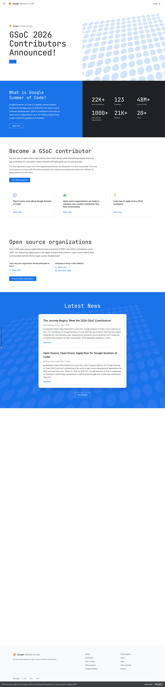

# Google Summer of Code (GSoC) Clone & AI Website Cloner

A pixel-perfect, production-ready clone of the **Google Summer of Code** ([summerofcode.withgoogle.com](https://summerofcode.withgoogle.com)) platform, powered by Next.js 16, React 19, TypeScript, and Tailwind CSS v4.

This repository serves a dual purpose:
1. **Google Summer of Code Web Application:** A fully responsive, accessible, multi-page implementation recreating the official GSoC website with authentic Google typography, iconography, and responsive layouts.
2. **Autonomous AI Website Cloner Skill:** A portable agentic workflow (`/clone-website`) located in `.agents/skills/clone-website/` that enables AI coding agents (Claude Code, Cursor, Codex, OpenCode, Antigravity) to reverse-engineer and clone any website into a clean Next.js codebase.

---

## Visual Preview



*High-fidelity recreation of the Google Summer of Code landing page and multi-page portal.*

---

## Key Features

### 🏛️ Google Summer of Code Web Application
- **Pixel-Perfect Fidelity:** Replicates the official GSoC layout, spacing, typography, and interactive components.
- **Multi-Route Navigation:**
  - `/` — **Homepage:** Hero section with official branding, dynamic ribbon, impact metrics, contributor journey, mentoring organizations grid, and latest announcements.
  - `/about` — **About GSoC:** Program history, mission, how it empowers students and open-source communities worldwide.
  - `/how-it-works` — **How It Works:** Contributor workflow, mentor requirements, milestone evaluations, and program timeline.
  - `/get-started` — **Get Started:** Comprehensive onboarding guides for both student contributors and open-source organizations.
  - `/archive` — **Program Archive:** Historical archive of past participating organizations, student projects, and cohorts.
  - `/rules` — **Program Rules:** Official contest rules, participant eligibility, stipend structures, and evaluation criteria.
  - `/terms` — **Terms & Privacy:** Terms of service, participation agreements, and program policies.
  - `/help` — **Help Center:** Frequently asked questions, support resources, and community guidance.
- **Authentic Google Design System:**
  - Google typography and color accents (Blue `#1a73e8`, Red `#ea4335`, Yellow `#fbbc04`, Green `#34a853`).
  - Interactive sticky navigation header with desktop dropdown menus and a mobile hamburger drawer.
  - Cookie consent banner, dot-grid pattern backgrounds, and custom vector SVG icons.
- **Responsive & Mobile-First:** Thoroughly tested and verified across desktop (1440px+), tablet, and mobile (390px) viewports (`docs/qa/`).

---

### 🤖 Autonomous AI Website Cloner Skill (`/clone-website`)

Included in this repository is an autonomous AI agent skill that transforms any AI coding assistant with browser capabilities into an automated frontend reverse-engineering engine.

Located at:
- **Canonical Skill:** [`.agents/skills/clone-website/SKILL.md`](.agents/skills/clone-website/SKILL.md)
- **Claude Code Bridge:** [`.claude/commands/clone-website.md`](.claude/commands/clone-website.md)

#### How the Cloning Pipeline Works

The `/clone-website` skill executes a structured 5-phase pipeline:

```
┌─────────────────┐     ┌───────────────────┐     ┌───────────────────────┐
│ 1. Recon &      │ ──> │ 2. Foundations &  │ ──> │ 3. Component Specs    │
│    Inspection   │     │    Asset Pipeline │     │    (docs/research/)   │
└─────────────────┘     └───────────────────┘     └───────────────────────┘
                                                              │
                                                              ▼
┌─────────────────┐     ┌───────────────────┐     ┌───────────────────────┐
│ Visual Diff QA  │ <── │ 5. Page Assembly  │ <── │ 4. Parallel Builder   │
│ (docs/qa/)      │     │    & Routing      │     │    Agents (Worktrees) │
└─────────────────┘     └───────────────────┘     └───────────────────────┘
```

1. **Phase 1: Reconnaissance & Deep Inspection**
   - Automatically opens the target URL in headless Chrome/Playwright.
   - Extracts live DOM structure, exact computed styles (`window.getComputedStyle`), interactive states (`:hover`, `:active`, `:focus`), and responsive breakpoints.
   - Captures high-resolution reference screenshots across viewport sizes.

2. **Phase 2: Foundations & Asset Pipeline**
   - Extracts color palettes, font stacks, and layout tokens into Tailwind CSS v4 / CSS variables.
   - Downloads all SVG icons, raster images, favicons, and webmanifests into `public/`.

3. **Phase 3: Component Specification Engine**
   - Writes deterministic component specifications to `docs/research/`.
   - Each spec details exact layout metrics, typography, responsive rules, and DOM nodes without ambiguity.

4. **Phase 4: Parallel Builder Agents & Git Worktrees**
   - Launches independent builder agents in isolated git worktrees, building components concurrently without merge conflicts.

5. **Phase 5: Page Assembly & QA Verification**
   - Integrates components into Next.js App Router routes (`src/app/`).
   - Runs automated visual comparisons against reference screenshots, storing audited artifacts in `docs/qa/`.

#### How to Clone Any Website

With your agent (Claude Code, Cursor, Codex, OpenCode, Antigravity) running in this repository with browser access enabled:

```bash
/clone-website https://example.com
```

The agent will autonomously inspect the target, extract assets, write component specifications, build the routes, and verify visual fidelity.

---

## Tech Stack

| Layer | Technology |
|---|---|
| **Framework** | [Next.js 16](https://nextjs.org/) (App Router, Turbopack, React 19) |
| **Language** | [TypeScript 5](https://www.typescriptlang.org/) (Strict Mode) |
| **Styling** | [Tailwind CSS v4](https://tailwindcss.com/) (oklch color tokens, native `@theme`) |
| **UI Primitives** | [shadcn/ui](https://ui.shadcn.com/) & Radix UI |
| **Icons** | Custom SVG components + [Lucide React](https://lucide.dev/) |
| **Linting & Code Style** | ESLint 9, PostCSS |
| **Containerization** | Docker & Docker Compose |

---

## Project Structure

```text
├── .agents/
│   └── skills/
│       └── clone-website/      # Canonical autonomous website cloner skill
├── .claude/
│   └── commands/
│       └── clone-website.md    # Claude Code command bridge
├── docs/
│   ├── design-references/      # Target site screenshots and visual captures
│   ├── qa/                     # Visual regression and verification screenshots
│   └── research/               # Computed DOM specs, CSS inspection, and tokens
├── public/
│   └── assets/                 # Downloaded media, brand icons, favicons, manifests
├── scripts/
│   └── download-assets.mjs     # Automated asset fetcher script
├── src/
│   ├── app/
│   │   ├── about/              # /about route
│   │   ├── archive/            # /archive route
│   │   ├── get-started/        # /get-started route
│   │   ├── help/               # /help route
│   │   ├── how-it-works/       # /how-it-works route
│   │   ├── rules/              # /rules route
│   │   ├── terms/              # /terms route
│   │   ├── globals.css         # Tailwind v4 theme and design tokens
│   │   ├── layout.tsx          # Root layout with Navbar, Footer & CookieConsent
│   │   └── page.tsx            # GSoC Homepage
│   ├── components/
│   │   ├── home/               # Homepage sections (Hero, Stats, News, Orgs, etc.)
│   │   ├── shared/             # Navbar, Footer, CookieConsent, Icons, DotGrid
│   │   └── ui/                 # Reusable UI primitives
│   └── lib/
│       └── utils.ts            # Class merging utility (clsx + tailwind-merge)
├── AGENTS.md                   # Single source of truth for agent instructions
├── Dockerfile                  # Production container build
├── docker-compose.yml          # Local and dev container orchestration
└── package.json                # Project dependencies and scripts
```

---

## Quick Start & Local Development

### Prerequisites

- **Node.js** 24 or newer
- **npm** (or your preferred package manager)

### Installation

1. **Clone the repository:**
   ```bash
   git clone https://github.com/bhavyaku11/Clone-Website.git
   cd Clone-Website
   ```

2. **Install dependencies:**
   ```bash
   npm install
   ```

3. **Start the development server:**
   ```bash
   npm run dev
   ```

4. Open [http://localhost:3000](http://localhost:3000) in your browser.

---

## Available Scripts

| Command | Description |
|---|---|
| `npm run dev` | Starts the Next.js development server (Turbopack) |
| `npm run build` | Compiles the production build with type checking and static generation |
| `npm run start` | Starts the Next.js production server |
| `npm run lint` | Runs ESLint across the codebase |
| `npm run typecheck` | Validates TypeScript types without emitting files |
| `npm run check` | Runs linting, typechecking, and production build in sequence |

---

## Running with Docker

You can also run the application using Docker and Docker Compose:

```bash
# Run the production app on port 3000
docker compose up app --build

# Run in development mode on port 3001 with hot reload
docker compose up dev --build
```

---

## Supported AI Agent Platforms

The autonomous cloning skill (`.agents/skills/clone-website/`) is portable and can be used across multiple agent platforms:

| Agent / IDE | Integration Method |
|---|---|
| **Claude Code** | Native support via command bridge at `.claude/commands/clone-website.md` |
| **Cursor** | Reads `.agents/skills/clone-website/` directly |
| **Codex CLI** | Reads `.agents/skills/clone-website/` directly |
| **OpenCode** | Reads `.agents/skills/clone-website/` directly |
| **Antigravity** | Directly invokable with browser subagents |

---

## Ethical Guidelines & Responsible Use

This project and its cloning engine are created for:
- **Educational purposes:** Deconstructing modern, production-grade frontend architectures, animations, and responsive patterns.
- **Platform migration:** Moving existing sites from legacy CMSs (e.g., WordPress, Webflow, Squarespace) to Next.js.
- **Disaster recovery:** Rebuilding lost frontend source code for web assets you own or have permission to reproduce.

**Prohibited Uses:**
- Do not use this tool for phishing, masquerading, impersonation, or malicious deception.
- Respect intellectual property rights, trademarks, brand assets, and copyright of original site creators.
- Check and respect target website terms of service and robots policies.

---

## License

This project is licensed under the [MIT License](LICENSE).
